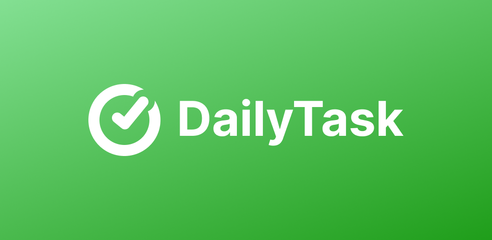

[](https://play.google.com/store/apps/details?id=com.dtaskapp)   

Dailytask is an application that helps you manage your daily tasks efficiently, supports data synchronization with Google Drive, and tracks work progress.

### 📸 [Screenshot](./screenshots/1.png)

---

## 🚀 Features

✅ Easy Task Management – Quickly add tasks, organize by category, and set priorities.
✅ Google Drive Sync – Securely store and restore your tasks without worrying about data loss.
✅ Track Work Progress – Review completed tasks and improve productivity.
✅ Visual Statistics – Analyze work performance with intuitive charts.
✅ Simple & User-Friendly Interface – Clean design, accessible to everyone.
✅ Multi-language Support – Experience the app in different languages.

---

## 🛠️ Installation

```bash
git clone https://github.com/thanh-ph2021/dailytask.git
cd dailytask
npm install
```

## 🏃‍♂️ Setting Up Google Drive API  

Follow these steps to enable **Google Drive API** and configure credentials for your app.  

### 🔹 1. Create a New Project  
1. Go to [Google Cloud Console](https://console.cloud.google.com/).  
2. Click **"New Project"** and enter your project details.  

### 🔹 2. Enable Google Drive API  
1. Navigate to **APIs & Services** > **Library**.  
2. Search for **Google Drive API**.  
3. Click **Enable** to activate the API for your project.  

### 🔹 3. Create OAuth Credentials  
1. Go to **APIs & Services** > **Credentials**.  
2. Click **Create Credentials** > **OAuth Client ID**.  
3. Choose **Application Type**:  
   - **Web Application**: Copy the **Client ID** and paste it into `webClientId` in `index.js`.  
   - **Android**: Configure Android settings as required.


## 🏃‍♂️ Run the App

```bash
npx react-native run-android
```

## 🛠️ Technologies Used

- React Native
- Redux
- Google Drive API
- AsyncStorage
- Victory Native

## 📬 Contact
Email: thanh.ph2021@gmail.com

If you like Dailytask, please consider **starring** the repository!
